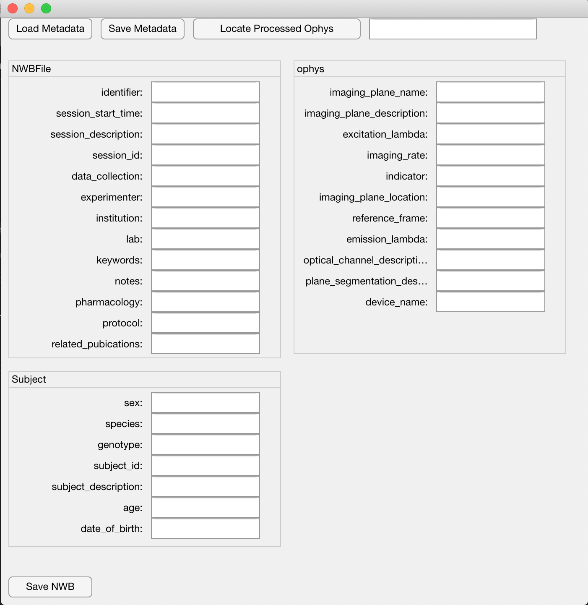

# nwb_schnitzer_lab
Repository for NWB standards and converting imaging data to NWB format. This package parses a YAML text file that specifies meta-data and combines that with an output of the CalciumImagingAnalysis pipeline to create an NWB file.

## Requirements
* [YAMLMatlab](https://code.google.com/archive/p/yamlmatlab/)

## Usage

### GUI

1. Run `ophys_giu`. 
2. Required meta-data can be entered manualy, or loaded from a YAML file. Entered data can be stored for later use. `template_meta_file.yml` provides an example YAML file. 
3. After entering meta-data, locate the filepath of the desired saved analysis (i.e. `*analysis.mat`)
4. Click Save NWB and choose a destination path.

Note: The purpose of the GUI is to make the process a little easier, but all of this can be done programatically. See `demo_script.m`.

`matnwb_map.yaml` maps from unique meta-data terms to argument inputs. This file should not be edited.